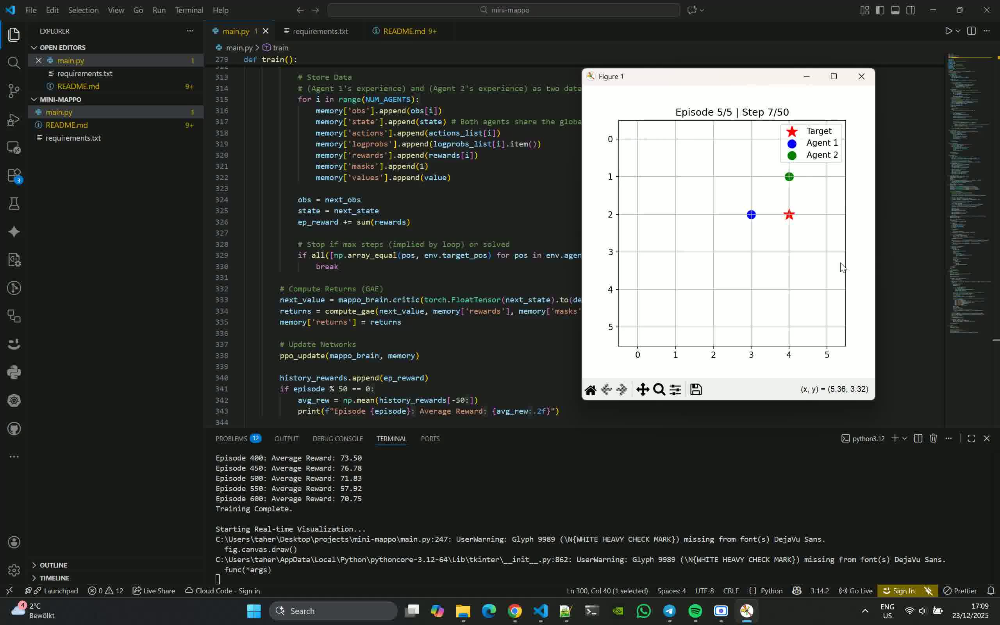

## What is MAPPO?
<b>MAPPO</b> adapts the popular PPO algorithm for multi-agent environments. It relies on a specific paradigm called Centralized Training, Decentralized Execution (CTDE).

1) Decentralized Execution (The Actor): When the agents are actually playing (or "executing"), they only see their own local observations. They don't know what others see.

2) Centralized Training (The Critic): During training, we allow the "Critic" (the network that estimates how good a situation is) to see everything—the global state or the observations of all agents combined. This helps the agents learn cooperative strategies faster.

## Demo Video

## Architecture
- Actor ($\pi_{\theta}$): Input is the local observation ($o_i$). Output is the action probability distribution.
- Critic ($V_{\phi}$): Input is the global state ($s$). In this implementation, the global state is simply all agents' observations concatenated together. Output is a single value score.

## Data Collection (Rollout)
- Observations
- Global States (all obs combined)
- Actions taken
- Log probabilities of those actions
- Rewards received

## Advantage Estimation (GAE)
We calculate how much "better" an action was compared to the average expectation. We use Generalized Advantage Estimation (GAE), which balances bias and variance to stabilize training.

## The PPO Update
We update the networks using the collected data.

- Clipping: Don't change the policy too drastically in one step. It clips the ratio between the new and old policy probabilities.

- Value Loss: We minimize the error between the Critic's prediction and the actual returns.

- Entropy: We add a bonus for randomness to prevent the agent from getting stuck doing the same thing too early.
  
## Contributing
Contributions are welcome. If you find a bug or have a feature request, please open an issue or submit a pull request.